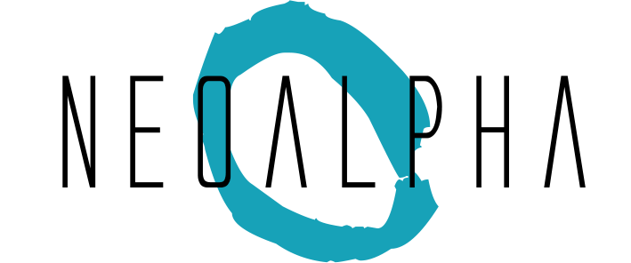

# Control de Fronteras (NeoAlpha 2.0)

## ¡Bienvenido al control de fronteras de NeoAlpha!

Se trata de un CRUD que controla las personas que salen y entran dentro una utopía futurística ficticia.
Vídeo explicativo(1.0): https://www.youtube.com/watch?v=6n3tz28sn74&feature=youtu.be
Vídeo explicativo(2.0): Coming Soon

## Novedades
1. Log Out
2. Progreso Laboral
3. PDA
